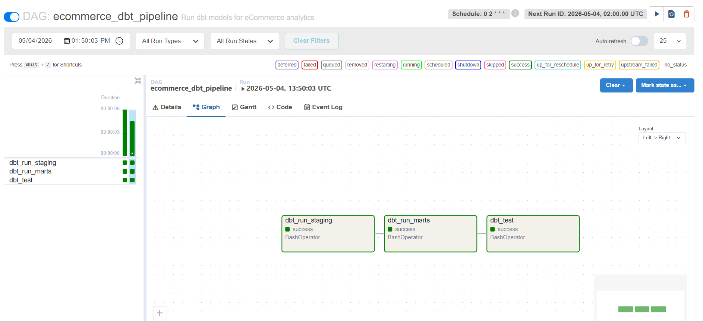

# eCommerce Analytics Pipeline

End-to-end data warehouse built with Snowflake, dbt, and Apache Airflow, transforming raw eCommerce transaction data into analytics-ready models.

## Project Overview

Production-grade analytics pipeline processing 15,000+ eCommerce transactions through staging, transformation, and dimensional modeling layers, orchestrated with Apache Airflow.

**Key Achievement:** Built a star schema data warehouse supporting customer lifetime value analysis, sales reporting, and product performance tracking with automated orchestration and data quality testing.

## Tech Stack

- **Data Warehouse:** Snowflake
- **Transformation:** dbt Core 1.11
- **Orchestration:** Apache Airflow 2.10
- **Containerization:** Docker
- **Languages:** SQL, Python
- **Version Control:** Git, GitHub

## Data Model

### Star Schema Design

**Fact Tables:**
- fct_orders - 15,000+ order line items with sales metrics and profitability
- fct_orders_incremental - Incremental version processing only new data

**Dimension Tables:**
- dim_customers - 1,000 customers with email and country segmentation
- dim_products - 200 products across 7 categories with profit margins
- dim_date - 3-year date dimension for time-series analysis

### Transformation Layers

1. **RAW Layer** - Unmodified source data (Snowflake tables)
2. **STAGING Layer** - Cleaned, typed, validated data (dbt views)
3. **MARTS Layer** - Business logic and star schema (dbt tables)

## Key Features

### dbt Transformations
- Star schema for optimal query performance
- Incremental models to process only new/changed data
- Data quality tests (unique, not_null, referential integrity)
- Reusable macros for standardized profit margin calculations
- Custom schema separation (STAGING vs MARTS)
- Source definitions with data lineage tracking

### Apache Airflow Orchestration
- Dockerized deployment for portability
- DAG dependencies (staging → marts → tests)
- Scheduled runs (daily at 2 AM)
- Error handling with retries
- Task monitoring via web UI

## Business Metrics Enabled

- Customer Lifetime Value (LTV)
- Sales by product category and country
- Order completion rates
- Profit margins by product
- Revenue trends over time
- Customer segmentation analysis

## Quick Start

### Prerequisites
- Snowflake account
- Python 3.11+
- Docker Desktop (for Airflow)
- dbt installed: `pip install dbt-snowflake`

### 1. Clone Repository

```bash
git clone https://github.com/bhagchandani/ecommerce-analytics-pipeline.git
cd ecommerce-analytics-pipeline/ecommerce_analytics
```

### 2. Generate Sample Data

```bash
python scripts/generate_sample_data.py
```

Creates 4 CSV files:
- raw_customers.csv (1,000 records)
- raw_products.csv (200 records)
- raw_orders.csv (5,000 records)
- raw_order_items.csv (15,000+ records)

### 3. Set Up Snowflake

```sql
CREATE DATABASE ECOMMERCE_DB;
CREATE SCHEMA ECOMMERCE_DB.RAW;
CREATE SCHEMA ECOMMERCE_DB.STAGING;
CREATE SCHEMA ECOMMERCE_DB.MARTS;

CREATE WAREHOUSE DEV_WH 
    WITH WAREHOUSE_SIZE = 'XSMALL' 
    AUTO_SUSPEND = 60 
    AUTO_RESUME = TRUE;
```

### 4. Load Data to Snowflake

Upload CSV files to Snowflake stage, then run:

```bash
sql/setup/01_create_raw_tables.sql
```

### 5. Configure dbt

Create `~/.dbt/profiles.yml`:

```yaml
ecommerce_analytics:
  target: dev
  outputs:
    dev:
      type: snowflake
      account: YOUR_ACCOUNT
      user: YOUR_USERNAME
      private_key_path: ~/.ssh/snowflake_key.p8
      role: ACCOUNTADMIN
      database: ECOMMERCE_DB
      warehouse: DEV_WH
      schema: STAGING
      threads: 4
```

### 6. Run dbt Transformations

```bash
dbt run           # Build all models
dbt test          # Run data quality tests
dbt docs generate # Generate documentation
dbt docs serve    # View at localhost:8080
```

### 7. Start Airflow (Docker)

```bash
docker compose up airflow-init  # Initialize (first time only)
docker compose up -d            # Start all services

# Access UI at http://localhost:8080
# Login: airflow / airflow
```

## Project Structure

## Project Structure

```text
ecommerce_analytics/
│
├── dags/
│   └── ecommerce_dbt_pipeline.py     # Main orchestration DAG
│
├── models/
│   ├── staging/                      # Clean, standardized data
│   │   ├── sources.yml               # Source definitions
│   │   ├── stg_customers.sql
│   │   ├── stg_products.sql
│   │   ├── stg_orders.sql
│   │   └── stg_order_items.sql
│   │
│   └── marts/                        # Star schema analytics
│       ├── schema.yml                # Tests and documentation
│       ├── fct_orders.sql            # Full refresh fact table
│       ├── fct_orders_incremental.sql # Incremental fact table
│       ├── dim_customers.sql
│       ├── dim_products.sql
│       └── dim_date.sql
│
├── macros/
│   ├── generate_schema_name.sql     # Custom schema macro
│   └── calculate_profit_margin.sql  # Reusable calculations
│
├── sql/
│   └── setup/
│       └── 01_create_raw_tables.sql # Snowflake initialization
│
├── scripts/
│   └── generate_sample_data.py      # Data generation
│
├── data/                             # Sample CSV files
├── screenshots/                      # Project screenshots
├── docker-compose.yaml               # Airflow configuration
└── dbt_project.yml                   # dbt configuration
```

## Skills Demonstrated

### Data Engineering
- ETL/ELT pipeline design and implementation
- Dimensional modeling (star schema)
- Data quality validation and testing
- Incremental processing strategies
- Workflow orchestration

### dbt Best Practices
- Modular SQL transformations
- Source/model documentation
- Automated testing framework
- Jinja templating & macros
- Schema management
- Incremental materialization

### DevOps & Orchestration
- Docker containerization
- Apache Airflow DAG development
- Dependency management
- Error handling and retries

### Cloud Data Platforms
- Snowflake architecture
- Stage-based data loading
- Schema organization
- Query optimization

## Production Architecture

In a real-world environment, this pipeline would operate as:

```text
┌─────────────────────┐
│ PostgreSQL          │
│ (Source Database)   │
└──────────┬──────────┘
           │
           ↓
┌─────────────────────┐
│ Fivetran            │
│ (Hourly Sync)       │
└──────────┬──────────┘
           │
           ↓
┌─────────────────────┐
│ Snowflake RAW       │
│ (Landing Zone)      │
└──────────┬──────────┘
           │
           ↓
┌─────────────────────┐
│ Airflow Trigger     │
│ (Daily 2 AM)        │
└──────────┬──────────┘
           │
           ↓
┌─────────────────────┐
│ dbt run --staging   │
└──────────┬──────────┘
           │
           ↓
┌─────────────────────┐
│ dbt run --marts     │
└──────────┬──────────┘
           │
           ↓
┌─────────────────────┐
│ dbt test            │
└──────────┬──────────┘
           │
           ↓
┌─────────────────────┐
│ Slack Notification  │
└──────────┬──────────┘
           │
           ↓
┌─────────────────────┐
│ BI Tools            │
│ (Tableau/Looker)    │
└─────────────────────┘
```

## Screenshots

### Airflow DAG Orchestration



The DAG shows the automated workflow with three sequential tasks:
1. **dbt_run_staging** - Clean and standardize raw data
2. **dbt_run_marts** - Build star schema fact and dimension tables
3. **dbt_test** - Validate data quality with automated tests

All tasks run sequentially with dependency management and error handling.

## Sample Queries

### Revenue by Country and Category

```sql
SELECT 
    c.country,
    p.category,
    COUNT(DISTINCT f.order_id) AS num_orders,
    SUM(f.total_price) AS revenue,
    SUM(f.profit) AS profit,
    ROUND(SUM(f.profit) / SUM(f.total_price) * 100, 2) AS profit_margin_pct
FROM marts.fct_orders f
JOIN marts.dim_customers c ON f.customer_id = c.customer_id
JOIN marts.dim_products p ON f.product_id = p.product_id
GROUP BY c.country, p.category
ORDER BY revenue DESC;
```

### Customer Lifetime Value

```sql
SELECT 
    c.customer_id,
    c.first_name || ' ' || c.last_name AS customer_name,
    c.country,
    COUNT(DISTINCT f.order_id) AS total_orders,
    SUM(f.total_price) AS lifetime_value,
    AVG(f.total_price) AS avg_order_value
FROM marts.fct_orders f
JOIN marts.dim_customers c ON f.customer_id = c.customer_id
GROUP BY 1, 2, 3
ORDER BY lifetime_value DESC
LIMIT 20;
```

## Author

**Beena Bhagchandani**  
Data Engineer | 4+ years DE experience | 9+ years total IT experience

📧 beenabhagchandani@gmail.com  
💼 [LinkedIn](https://www.linkedin.com/in/beena-bhagchandani-b5322855/)  
🔗 [GitHub](https://github.com/bhagchandani)

## License

This project is for portfolio purposes.